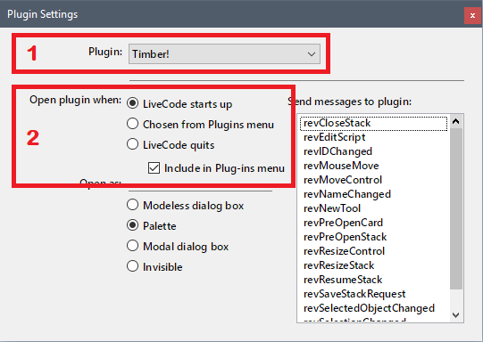

# Timber!

## Logging and Benchmarking Plugin for LiveCode.


### Plugin Installation and Mainstack Setup

Two steps are required to use Timber effectively. Installing the plugin allows you to begin logging, and Mainstack setup allows your stack to work properly when shared with others.


**Plugin Installation**

1. Place **Timber!.livecode** into your LiveCode User Plugins folder
2. Launch LiveCode
3. From the **Development** menu, move to **Plugins** and choose **Plugin Settings**
	1. Choose **Timber!** from the Plugin option menu
	2. Under **Open plugin when**, choose **LiveCode starts up**
	
	
	
4. Close the Plugin Settings window.


**Mainstack Setup**

Add the following code to the end of your main stack's script. This will allow you to share your stack with LiveCode users who do not have Timber installed. 

```
### Timber Support Code
### Prevent Timber! errors if plugin is not installed
### https://github.com/speedbump1981/Timber
on timberLog
     exit timberLog
end timberLog
on timberView
     answer "Timber! Logging plugin for LiveCode is not installed. It's Free and Open Source." with "Dismiss" or "View on Github"
     if it is "View on Github" then launch url "https://github.com/speedbump1981/Timber"
     exit timberView
end timberView
### // End Timber Support Code
```


### Commands

**timberLog**

Add your custom log message to the Timber log.

	timberLog [eventMessage], [personalDetails], [eventSender], [eventType], [benchSignal]

Parameter | Type | Description
--------- | ---- | -----------
eventMessage | string | The message you would like to log. \[Optional\]
personalDetails | string | Private information to be excluded by default. \[Optional\]
eventSender | string | The name of the handler invoking the log entry. \[Optional\]
eventType | string | 'info' is the default, but you may supply 'error', 'note', and other custom types. \[Optional\]
benchSignal | flag | 'start' or 'stop' \[Optional\]

*Usage Example*
```
### stack script

on openStack
	
	-- Log if this system is Windows 10
	if systemVersion() is "NT 10.0" then
		
		timberLog "OS is Windows 10",,"openStack"
		
	end if
	
end openStack
```

**timberView**

Displays the Timber log in a palette. Use this command to add a *View Log* button or menu to your stack.

	timberView

Parameter | Type | Description
--------- | ---- | -----------
 | | 

*Usage Example*
```
### card button "Show Log"

on mouseUp
	
	-- Display the Timber! Log
	timberView
	
end mouseUp
```

